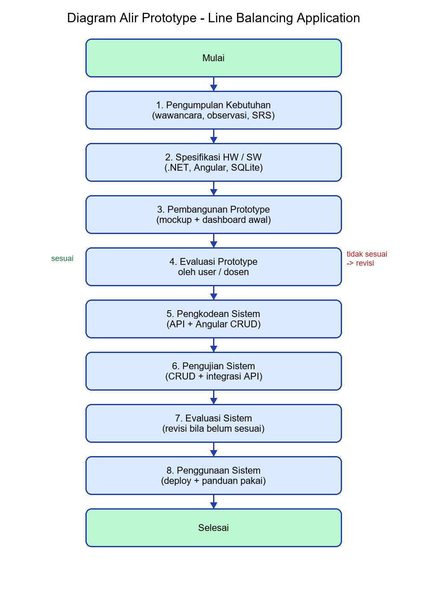
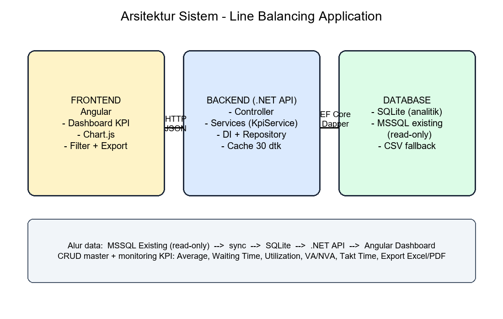
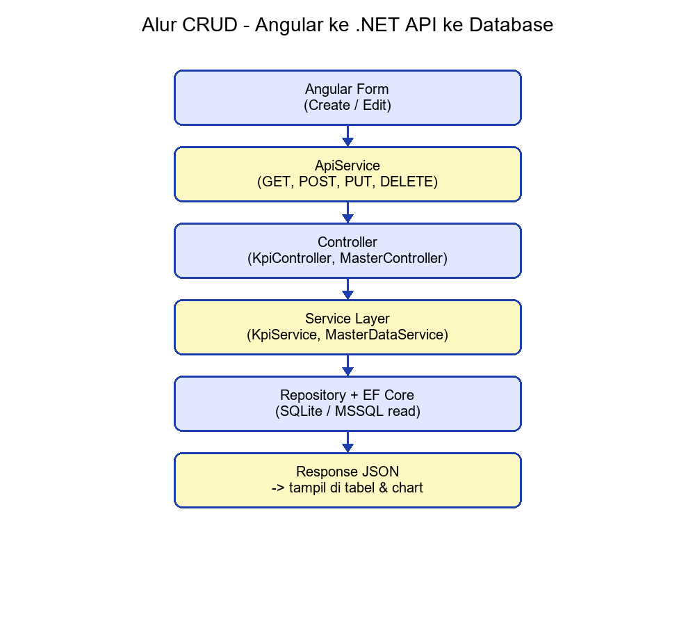
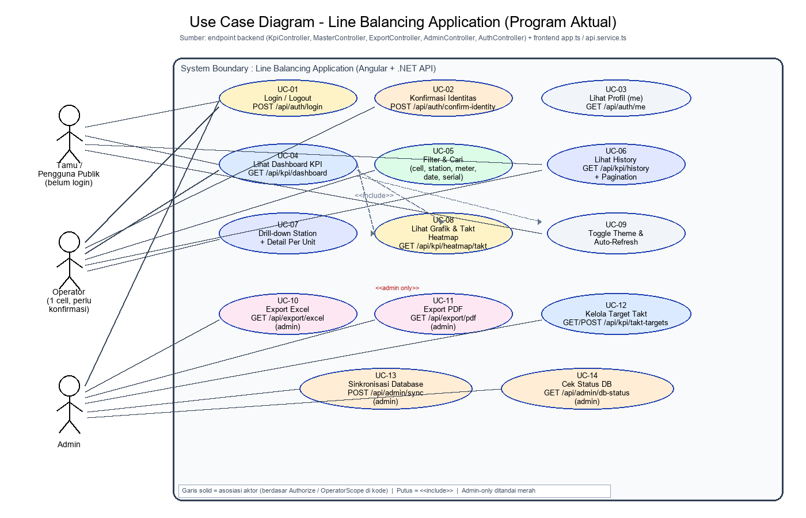

# BAB 3 – Metodologi Pengembangan Sistem

**Judul:** Sistem CRUD Berbasis ERD yang Terhubung ke API .NET dan Angular untuk Line Balancing Application
**Model pengembangan:** Prototype
**Stack:** Angular (frontend) + .NET Web API (backend) + SQLite (database analitik) + Database Existing perusahaan (read-only)

---

## a. Diagram Alir Prototype

Paragraf 1 — Tahap ini menggambarkan alur kerja model prototype yang digunakan dalam penelitian, mulai dari pengumpulan kebutuhan, pembangunan prototype, evaluasi oleh pengguna, hingga pengkodean, pengujian, evaluasi akhir, dan penggunaan sistem. Diagram alir disusun agar setiap tahapan memiliki hubungan yang jelas dan berurutan, sehingga proses pengembangan dapat dipahami dengan mudah oleh pembaca laporan. Dengan adanya diagram ini, pembimbing dan penguji dapat melihat gambaran besar metodologi tanpa harus membaca seluruh uraian terlebih dahulu.

Paragraf 2 — Model prototype dipilih karena kebutuhan pengguna pada Line Balancing Application tidak dapat dirumuskan secara lengkap di awal. Pengguna perlu melihat tampilan dashboard, tabel data, dan grafik KPI terlebih dahulu sebelum memberikan masukan. Oleh karena itu, alur prototype memberi ruang untuk membangun versi awal sistem, menunjukkannya kepada pengguna, menerima evaluasi, lalu melakukan revisi secara berulang sampai kebutuhan benar-benar sesuai. Pendekatan ini sangat cocok untuk aplikasi dashboard yang bersifat visual dan interaktif.

Paragraf 3 — Gambar diagram alir prototype dapat dilihat pada Gambar 3.1 berikut. Diagram tersebut menjadi acuan utama dalam pelaksanaan seluruh tahapan pada bab ini. Setiap kotak pada diagram berkorespondensi dengan satu subbab, yaitu Spesifikasi Hardware/Software, Pengumpulan Kebutuhan, Pembangunan Prototype, Pengkodean Sistem, Pengujian Sistem, Evaluasi Sistem, dan Penggunaan Sistem.

*Gambar 3.1 – Diagram alir model prototype Line Balancing Application. Jika evaluasi menyatakan prototype belum sesuai, alur kembali ke pembangunan prototype (revisi). Jika sudah sesuai, alur lanjut ke pengkodean sistem.*

Arsitektur teknis yang menjadi konteks prototype ditunjukkan pada Gambar 3.2, sedangkan alur CRUD end-to-end ditunjukkan pada Gambar 3.3.

*Gambar 3.2 – Arsitektur sistem: Angular → .NET Web API (Controller, Services, DI, Repository) → SQLite / database existing.*

*Gambar 3.3 – Alur CRUD dari form Angular sampai database dan kembali sebagai JSON.*

---

## b. Spesifikasi Hardware dan/atau Software

Paragraf 1 — Spesifikasi hardware dan software ditetapkan di awal agar lingkungan pengembangan dan pengujian memiliki standar yang sama. Penetapan ini penting supaya hasil pengujian dapat dipertanggungjawabkan, karena performa aplikasi dashboard sangat dipengaruhi oleh perangkat dan versi perangkat lunak yang digunakan. Tanpa spesifikasi yang jelas, perbedaan hasil antara komputer pengembang dan komputer penguji sulit dijelaskan.

Paragraf 2 — Spesifikasi software yang digunakan dalam penelitian ini adalah sistem operasi Windows 10/11 64-bit, .NET SDK 10 untuk backend Web API, Node.js 18+ dan Angular 21 dengan Chart.js untuk frontend, serta SQLite sebagai database analitik lokal. Database existing perusahaan (misalnya MS SQL Server) diakses secara read-only melalui koneksi terenkripsi. Peramban yang digunakan untuk pengujian adalah Google Chrome, Microsoft Edge, dan Mozilla Firefox versi modern. Seluruh kredensial database disimpan pada file konfigurasi atau environment variable, bukan di dalam kode program.

Paragraf 3 — Spesifikasi hardware minimal yang digunakan adalah prosesor setara Intel Core i5, RAM 8 GB, penyimpanan 20 GB, dan koneksi jaringan intranet perusahaan untuk mengakses database existing. Spesifikasi ini dianggap cukup karena pengolahan KPI dilakukan secara agregat di sisi server dengan mekanisme caching, sehingga beban di sisi klien tetap ringan. Tabel spesifikasi lengkap dicantumkan pada laporan sebagai Tabel 3.1 agar mudah dikutip saat sidang.

**Tabel 3.1 – Spesifikasi (ringkas, disalin ke laporan sebagai tabel):**

| Kategori | Item | Keterangan |
|---|---|---|
| Software | OS, .NET 10, Node 18+, Angular 21, SQLite | Lingkungan dev & uji |
| Software | Browser modern, Swagger UI | Pengujian API & UI |
| Hardware | CPU i5, RAM 8 GB, intranet | Minimal pengujian dashboard |
| Data | DB existing (read-only), 5 CSV dummy | Fallback bila MSSQL tidak tersedia |

---

## c. Pengumpulan Kebutuhan

Paragraf 1 — Pengumpulan kebutuhan dilakukan untuk mengetahui apa saja yang harus disediakan oleh sistem, siapa penggunanya, dan data apa yang tersedia. Kegiatan yang dilakukan meliputi studi literatur tentang line balancing, CRUD, API .NET, Angular, ERD, dan SRS, serta observasi terhadap proses pencatatan data produksi yang sudah berjalan di perusahaan. Dari kegiatan ini diperoleh daftar kebutuhan fungsional seperti Average Per Station, Total Test, Waiting Time, Utilization, VA/NVA, Historical Data, Chart, Export Laporan, dan monitoring Takt Log Time.

Paragraf 2 — Selain studi literatur, dilakukan identifikasi aktor berdasarkan implementasi program aktual, yaitu Tamu/Pengguna Publik (dapat melihat dashboard tanpa login), Operator (akun terikat 1 cell, wajib konfirmasi identitas via `POST /api/auth/confirm-identity`, akses dibatasi oleh `OperatorScope.EnforceCell`), dan Admin (akses penuh termasuk `GET /api/export/excel|pdf`, `POST /api/admin/sync`, dan `GET/POST /api/kpi/takt-targets`). Pembagian peran ini terbukti dari kode di `AuthController.cs`, `KpiController.cs`, `ExportController.cs`, dan `AdminController.cs`, bukan dari dokumen perencanaan.

Paragraf 3 — Keluaran tahap ini berupa daftar use case yang benar-benar ada di program beserta pemetaan ERD ke tabel aktual (`Cell`, `Station`, `MeterType`, `UnitMaster`, `TaktLogTime` dengan `ArrivalTime/StartTime/EndTime`) seperti didefinisikan di `AppDbContext.cs` dan `MasterEntities.cs`. Dokumentasi dilengkapi use case diagram berbasis kode agar jejak kebutuhan dapat ditelusuri langsung ke endpoint/frontend, tanpa mengacu pada SRS. Diagram inilah yang menjadi dasar pembangunan prototype.

*Gambar 3.4 – Use Case Diagram berbasis implementasi program (bukan SRS). Tiga aktor: Tamu/Publik, Operator (1 cell + konfirmasi), dan Admin. 14 use case dipetakan ke endpoint aktual: Auth (`/api/auth/login|me|confirm-identity`), KPI (`/api/kpi/dashboard|history|heatmap/takt|takt-targets`), Master (`/api/master/cells|stations|meter-types`), Export (`/api/export/excel|pdf` – admin only), Admin (`/api/admin/sync|db-status` – admin only), serta interaksi frontend (`filter`, `drill-down`, `theme/auto-refresh`, `chart`). Garis solid = asosiasi berdasar `Authorize`/`OperatorScope`, garis putus = <<include>>/*

---

## d. Pembangunan Prototype

Paragraf 1 — Pembangunan prototype adalah pembuatan versi awal sistem yang dapat dilihat dan dicoba oleh pengguna, meskipun belum lengkap. Pada penelitian ini prototype yang dibangun meliputi struktur ERD awal, endpoint API dasar, dan tampilan dashboard Angular yang menampilkan KPI cards, grafik, filter Cell/Station/Meter Type, serta tabel ringkasan. Tujuannya bukan kesempurnaan, melainkan kecepatan umpan balik: pengguna dapat langsung menilai apakah tampilan dan alur data sudah sesuai harapan.

Paragraf 2 — Prototype backend dibangun dengan pemisahan layer sejak awal, yaitu Controller (misalnya `KpiController`, `MasterController`), Services (misalnya `KpiService`, `MasterDataService`, `MetricCalculator`), Repository (`ProductionRepository`), dan Dependency Injection pada `Program.cs`. Struktur ini membuat revisi prototype menjadi murah, karena perubahan rumus KPI hanya menyentuh `MetricCalculator`, sedangkan perubahan endpoint hanya menyentuh Controller. Di sisi frontend, prototype memakai `ApiService` untuk memanggil API dan `app.html` untuk menampilkan dashboard, sehingga setiap perubahan kebutuhan filter atau grafik dapat ditunjukkan dengan cepat.

Paragraf 3 — Hasil tahap ini adalah prototype yang dapat didemokan, lengkap dengan gambar mockup/tangkapan layar dashboard versi awal. Setiap gambar diberi nomor dan keterangan (misalnya Gambar 3.4 Prototype Dashboard v1). Kumpulan gambar inilah yang dibawa saat bimbingan untuk meminta tanggapan dosen: apakah ERD sudah benar, apakah pembagian layer API sudah rapi, dan apakah tampilan Angular sudah sesuai kebutuhan pengguna.

---

## e. Pengkodean Sistem

Paragraf 1 — Pengkodean sistem adalah implementasi penuh dari rancangan dan prototype yang telah disetujui. Pada tahap ini seluruh hasil evaluasi prototype diterjemahkan menjadi kode final. Backend dikembangkan menggunakan .NET Web API dengan Entity Framework Core untuk SQLite dan Dapper untuk akses read-only ke database existing. Frontend dikembangkan menggunakan Angular dengan Chart.js untuk visualisasi. Setiap fitur CRUD dan monitoring KPI dihubungkan dari form Angular, melalui HTTP request, ke Controller, lalu ke Service, Repository, dan database, kemudian hasilnya dikembalikan sebagai JSON.

Paragraf 2 — Prinsip utama pada tahap ini adalah pemisahan tanggung jawab antar layer. Controller hanya menerima request, melakukan validasi parameter (misalnya `page ≥ 1` dan `1 ≤ pageSize ≤ 100` pada endpoint history), dan memanggil Service. Service berisi logika bisnis seperti perhitungan Average Per Station, Waiting Time (`Start − Arrival`), Utilization, VA/NVA, perbandingan Takt Time, agregasi per cell, dan unit flow. Repository hanya berisi query database dengan projection minimal agar cepat, dilengkapi index dan caching (dashboard 30 detik, data master 5 menit). Dependency Injection digunakan untuk mendaftarkan Controller, Service, Repository, cache, dan konfigurasi `KpiOptions` (target takt 48 detik) sehingga ketergantungan antar komponen bersifat longgar dan mudah diuji.

Paragraf 3 — Dokumentasi tahap ini dilengkapi dengan gambar struktur folder backend/frontend dan potongan arsitektur (bukan seluruh kode). Misalnya Gambar 3.5 Struktur Folder API dan Gambar 3.6 Alur Request CRUD. Dengan dokumentasi tersebut, pembaca laporan dapat memahami kerapian kode tanpa harus membaca seluruh source code. Seluruh kode disimpan pada repositori Git sehingga setiap perubahan tercatat dan dapat ditinjau oleh dosen pembimbing.

---

## f. Pengujian Sistem

Paragraf 1 — Pengujian sistem dilakukan untuk memastikan setiap fungsi berjalan sesuai kebutuhan yang tercantum pada SRS dan acceptance criteria. Pengujian mencakup fungsi CRUD data master, endpoint dashboard (`GET /api/kpi/dashboard`), endpoint history terpaginasi (`GET /api/kpi/history`), endpoint master (cells, stations, meter-types), serta endpoint export Excel dan PDF. Pengujian API dilakukan melalui Swagger UI, sedangkan pengujian tampilan dilakukan melalui peramban pada frontend Angular.

Paragraf 2 — Selain pengujian fungsional, dilakukan pengujian integrasi antara Angular dan API .NET untuk memastikan data yang diinput dari form tersimpan ke database dan tampil kembali pada tabel dan grafik dengan benar. Pengujian juga mencakup skenario gagal, misalnya koneksi database terputus, filter tidak menghasilkan data, atau parameter halaman tidak valid. Sistem yang baik harus menampilkan pesan yang jelas dan tidak crash; misalnya menampilkan status `connected/disconnected`, pesan `N/A` untuk station tanpa data, dan response 400 untuk parameter yang salah.

Paragraf 3 — Setiap hasil pengujian didokumentasikan dalam bentuk tabel uji dan tangkapan layar (screenshot). Contohnya Gambar 3.7 Hasil Uji Endpoint di Swagger, Gambar 3.8 Tampilan Dashboard Setelah Integrasi, dan Gambar 3.9 Hasil Export Excel/PDF. Tabel pengujian memuat kolom kasus uji, langkah, hasil yang diharapkan, hasil aktual, dan status (lolos/gagal). Bukti visual ini sangat penting untuk bimbingan, karena dosen dapat langsung menilai kemajuan program dari gambar, bukan sekadar narasi.

---

## g. Evaluasi Sistem

Paragraf 1 — Evaluasi sistem adalah penilaian menyeluruh terhadap hasil pengujian untuk menentukan apakah sistem sudah layak atau masih memerlukan revisi. Pada tahap ini setiap temuan gagal uji, masukan pengguna, dan catatan dosen pembimbing dikumpulkan dan diprioritaskan. Evaluasi tidak hanya melihat benar-salah fungsi, tetapi juga kerapian layer API, kemudahan pemeliharaan, kecepatan dashboard (target memuat data 1 bulan ≤ 5 detik), dan kesesuaian tampilan dengan kebutuhan aktor.

Paragraf 2 — Jika evaluasi menyatakan sistem belum sesuai, maka alur kembali ke tahap pembangunan prototype atau pengkodean untuk dilakukan perbaikan, sesuai prinsip model prototype. Setiap siklus revisi dicatat: apa masalahnya, apa perbaikannya, dan bagaimana hasil uji ulangnya. Pencatatan siklus ini menjadi bukti proses iteratif yang sangat dihargai dalam laporan skripsi, karena menunjukkan bahwa sistem berkembang berdasarkan umpan balik nyata, bukan sekali jadi.

Paragraf 3 — Hasil evaluasi disajikan dalam bentuk tabel rekap revisi dan bila memungkinkan grafik perbandingan sebelum-sesudah perbaikan (misalnya waktu muat dashboard atau jumlah kasus uji yang lolos). Tabel ini memudahkan dosen melihat kemajuan antar bimbingan. Ketika seluruh kriteria penerimaan (acceptance criteria AC-01 sampai AC-10 pada SRS) dinyatakan terpenuhi, sistem dinyatakan siap masuk ke tahap penggunaan.

---

## h. Penggunaan Sistem

Paragraf 1 — Penggunaan sistem adalah tahap penerapan aplikasi pada lingkungan sebenarnya atau lingkungan uji yang menyerupai kondisi nyata. Pada tahap ini backend dan frontend dijalankan bersamaan (backend pada port `5121`, frontend pada port `4200`), koneksi read-only ke database existing dikonfigurasi, dan sinkronisasi awal ke SQLite dilakukan melalui endpoint `POST /api/admin/sync`. Pengguna akhir mulai memakai dashboard untuk memantau Average Per Station, Waiting Time, Utilization, VA/NVA, dan status Takt Time.

Paragraf 2 — Agar sistem dapat dipakai secara mandiri, disusun panduan penggunaan yang mencakup cara menjalankan aplikasi, cara memakai filter Cell/Station/Meter Type, cara membaca KPI dan grafik, cara mengekspor laporan Excel/PDF, serta cara memeriksa status koneksi database (`GET /api/admin/db-status`). Panduan ini dilengkapi dengan tangkapan layar setiap halaman penting, misalnya Gambar 3.10 Halaman Dashboard, Gambar 3.11 Halaman History, dan Gambar 3.12 Contoh Laporan PDF. Dengan panduan bergambar, pengguna baru dapat memahami sistem tanpa pelatihan panjang.

Paragraf 3 — Tahap ini juga mencakup serah terima dan pemeliharaan awal, yaitu penjelasan kepada administrator tentang lokasi konfigurasi, cara mengganti target takt time tanpa rebuild (`Kpi:TargetTaktSeconds`), dan batasan sistem (read-only terhadap database existing, hanya SELECT). Catatan pemeliharaan ini memastikan aplikasi Line Balancing tetap berjalan stabil setelah penelitian selesai dan siap dikembangkan lebih lanjut, misalnya penambahan KPI baru atau koneksi ke lebih banyak database.

---

*Dokumen ini disimpan di folder Dokumentasi bersama empat gambar pendukung (diagram alir, arsitektur, alur CRUD, dan use case). Nomor gambar/tabel menyesuaikan penomoran pada laporan akhir (BAB 3).*
